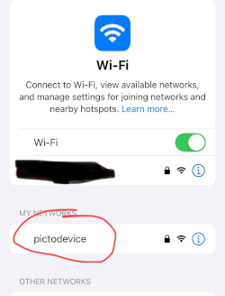
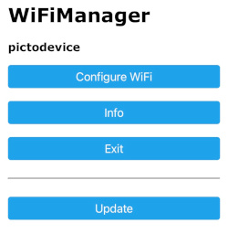

.. _first_start:

===========
First Start
===========

Network Configuration Mode
==========================

When the PictoStick boots for the first time, it will start in 
'network configuration mode'. In this mode we will configure the 
device (once only) to connect to your local WiFi network. This will
enable the device to sync the correct time via the NTP-network
protocol automatically and prepare the device for future configuration
by the Parents, Caretacker or Health professional.

When the device boots for the first time a white screen is displayed
on the device (TODO: make screen) and you will be able to configure
the device. You will need a mobile telephone  or computer connected to 
your local WiFi network. Keep your wifi SSID and password handy.

On your phone or computer go to the WiFi network settings and connect to 
WiFi network labeled 'pictodevice'. If prompted for a password, you can use
password 'p@ssw0rd'. 

Still on the phone or computer you will be presented with the WiFiManager 
screen and you can select the 'Configure WiFi' menu option to configure the 
PictoStick device to connect to your local WiFi network. This you will need
to do only once. 

After this the device will boot in normal mode. In normal mode for everyday
use the device will *not* use the configured WiFi connection by default to 
conserve battery power. It will have stored the netwtowrk credentials for when needed
as well as the correct time which is stored in the RTC clock on the PictoStick
device.
